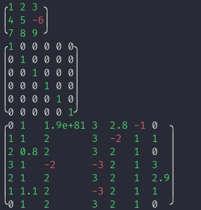

# PyMatrix



## What it it?

PyMatrix is a python module that allow you to create representations of multiple matrixes and make operations between them.

## Disclaimer

This module has been made for the purpose of testing and playing with matrixes only, it is not optimized enough to be used as a real project.

# Documentation

Interaction with matrixes has been made simple by using object representations.

## Importing the module

To use this module, simply import the `matrix.py` and `table.py`.

```sh
git clone https://github.com/Egsagon/pymatrix
cp pymatrix/*.py /path/to/project/
```

Then, simply import it using the python `import` builtin.

```python
import matrix                         # Classic import 
# from matrix import Matrix           # Import main class only
# from matrix import Matrix, Presets  # Also import presets

...
```

## Creating a new matrix

### Defining a new one

Matrix creation can be done calling the `Matrix()` function.

To define the elements inside the matrix, you need to specify one `tuple` / `list` per row. Each value inside each row will be considered as a new column.

Just like real matrixes, you need to specify at least one row and one column, and all lines must have the same lenght.

```python
# Define a 3x3 matrix filled with ones
my_matrix = matrix.Matrix((1, 1, 1),
                          (1, 1, 1),
                          (1, 1, 1))

# Define a row matrix with 3 columns
my_matrix = matrix.Matrix((1, 2, 3))

# Define a column matrix with 3 rows
my_matrix = matrix.Matrix((1),
                          (2),
                          (3))

# Define a one-value matrix
my_matrix = matrix.Matrix([1])
```

Any real value is accepted, including:

```python
my_matrix = matrix.Matrix((1),      # ints
                          (0.1),    # floats
                          (4e-6),   # those things
                          (-5))     # negatives

# ... and any number that is considered as a int or float by python.
```

### Presets

There are two matrix presets available:

```python

# Neutral matrixes (filled with zeroes and a diagonale of ones)
# The size is an int that presize the numbers of rows/columns.
neutral = matrix.Preset.Neutral(size = 4)

# Null matrixes (filled with zeroes)
# The size is an iterable that presize the number of rows/columns.
O = matrix.Preset.Null(size = (2, 4))
```

## Displaying a matrix

You can print a matrix to the terminal using the `matrix.Matrix.print()` method.

For example:
```python
>>> m = matrix.Matrix((1, 2, 3),
                      (4, 5, 6),
                      (7, 8, 9))

>>> m.print()
╭1 2 3╮
│4 5 6│
╰7 8 9╯
```

You can also get the raw format with the `matrix.Matrix.join()` method, if you want to redirect the ouput of the string or including it in a tui or something:

```python
>>> m.join()
'╭\x1b[0;32m1\x1b[0m \x1b[0;32m2\x1b[0m \x1b[0;32m3\x1b[0m╮\n│\x1b[0;32m4\x1b[0m \x1b[0;32m5\x1b[0m \x1b[0;32m6\x1b[0m│\n╰\x1b[0;32m7\x1b[0m \x1b[0;32m8\x1b[0m \x1b[0;32m9\x1b[0m╯'
```

## Accessing and modifying the matrix values

### Getting and modifying values

Matrix modification is done just like a normal table. For instance:

```python
>>> m[0][1] # Returns the element at row 0 and column 1
2
>>> m[-1][-1] # Returns the last element
9
>>> m[1][1] = -7 # Modify the value on row 1 column 1
>>> m.print()
╭1 2  3╮
│4 -7 6│
╰7 8  9╯
```

### Getting whole rows and columns

Getting a row done exactly like a list.

```python
row_1 = m[0]
row_2 = m[1]
row_last = m[-1]
...
```

For columns, you can call the `matrix.Matrix.get_column()` method.
The index argument must be either an int, specyfing the number of the line,
or a tuple containing arguments for a range function (if you want to obtain multiple lines).

```python
col_1 = m.get_column(0)
col_2 = m.get_column(1)
col_last = m.get_column(-1)
col_1_to_3 = m.get_column((0, 3))
all_columns = m.get_column((0, -1))
...
```

You can also call the `matrix.Matrix.reverse(content)` method, which will returns a rotated version
of a matrix.

```python
m_columns = m.reverse(m.content) # Get columns

m_rows = m.reverse(m_columns) # Switch back to rows
```


## Matrix operations

For now, the following operation with matrixes are available:

```python
m1 = matrix.Matrix((1, 2, 3),
                   (4, 5, 6))

m2 = matrix.Matrix((1, 1, 2),
                   (1, 3, 9))

# Addition
res = m1 + m2
m1 += m2

# Substraction
res = m1 - m2
m1 -= m2

# Multiplication with a real
m3 = 2 * m1
    # Note: the inverse operation is deprecated and won't be possible unless matrix.Matrix.allow_nmul is set to True.
    # m3 = m1 * 2

# Multiplication with another matrix
res = m1 * m2
m1 *= m2
```

Note: All those operations must be done under the matrix rules, or they will raise an error.
For instance, they must have the same size if they are substracted or added.


# That's all

have fun
